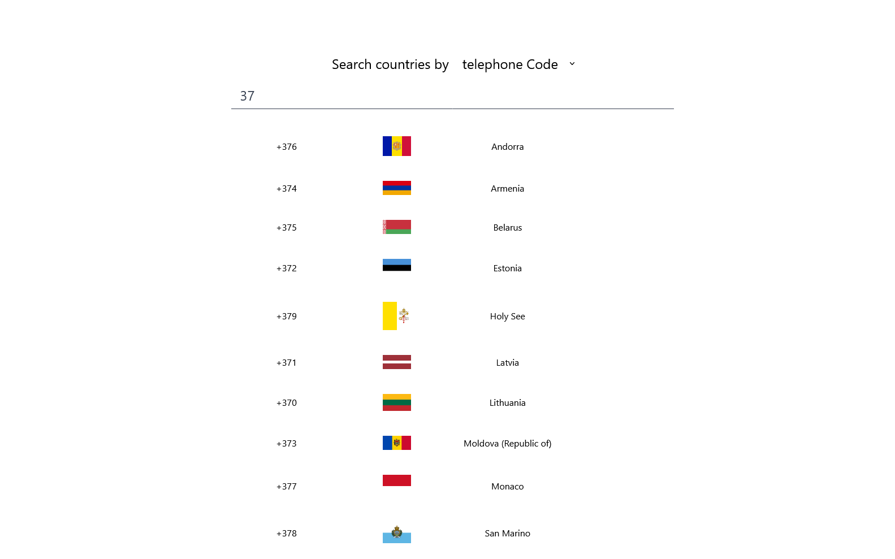
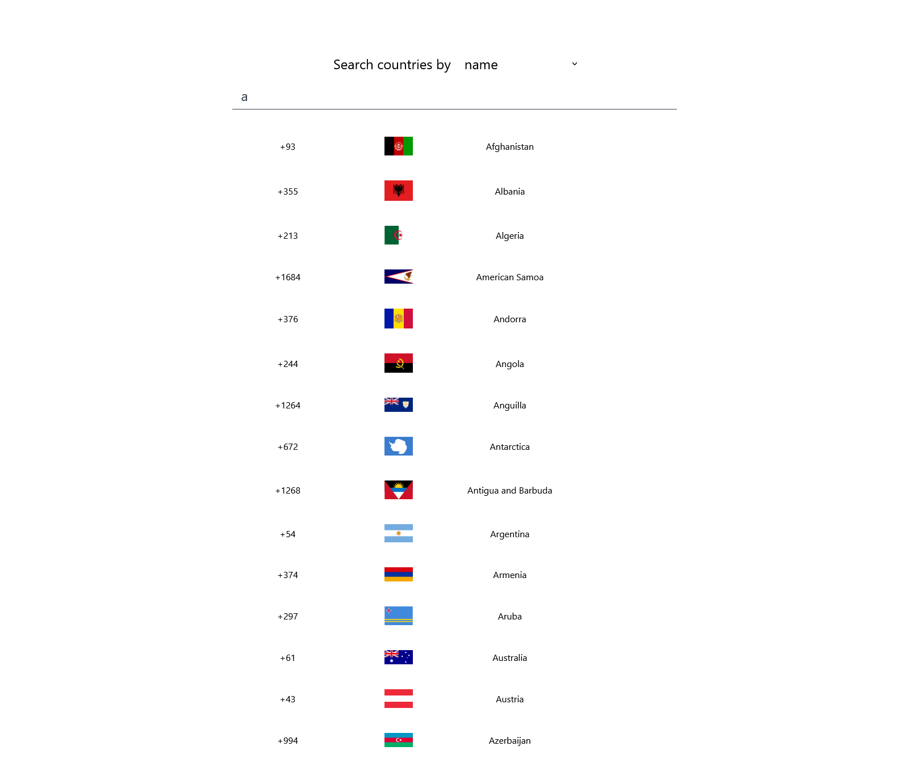

# Welcome "Find Country" project
## A simple, project for finding countries

---

To use it, simply:

* Type country name in the input bar
* Change search type (country name or telephone code)
* Type country telephone code and found country

 'Find country' UI 

### Filtered by Telephone code

### Filtered by Country name

